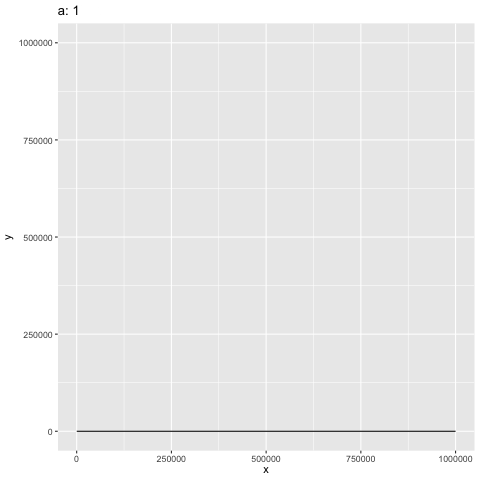
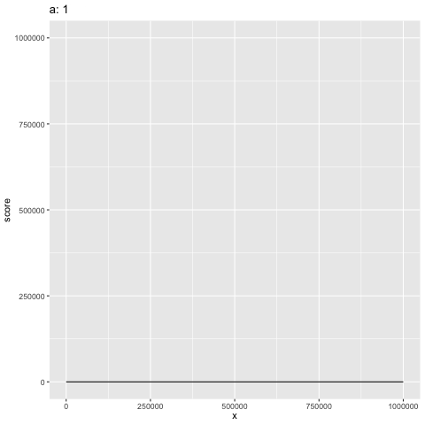

## CorrelationGene

## Getting Started

```{r}
library(Seurat)
library(Matrix)
library(tictoc)
library(Hmisc)
library(moments)
library(org.Hs.eg.db)
library(CorrelationGene)
library(bestNormalize)

dev = readRDS("dev_processed.rds") # This dataset is from Velmeshev et al. 2023, and has already been processed through the Seurat workflow.
Idents(dev) = "lineage" # It is important to set the identity to whatever condition you would like.
```

## Introduction

Seurat is one of the most widely used R packages for RNA-seq analysis and visualisation. CorrelationGene extends the data analysis of Seurat using condition-specific Pearson/Spearman correlations. The output is a score based on normalized values of expression correlation, cell number proportion of the dataset and p adjusted values. This allows us to find the most significantly co-expressed genes with a gene of interest.

### Equation for scoring function

```{r}
equation = function(a,x,R, padj) {
  b = a/4.138e+10
  c = 3
  y = a / (1+exp(-(b*x-c)))
  score = (y*R)/(log(padj+2))
  score = orderNorm(score)
  score = score$x.t
  return(score)
}
```
a = maximum cell number of a condition

$$
y = \frac{a}{1 + e^{-(bx - c)}}, b = 4.13E-10, c = 3
$$

$$
\text{score} = \frac{yR}{\log(\text{padj}+2)}
$$





There is intended bias for the y values to be exponentially larger at larger x values for scores to favor high scores for Pearson coefficients calculated with more cell samples. This hopefully removes inflated correlation values associated with low cell number count in RNA-seq data. In the future, the parameters needs to be optimized.

## Workflow

```{r}
goi = "ENSG00000080298" #symbol for RFX3 gene
gene_list = rownames(dev) #this can be anything, however if the gene symbols are in ensembl form, so does the gene_list
PorS = "P" #P for Pearson, S for Spearman
ensembl = "TRUE"

RFX3_correlation = express_cell_RNA(dev, goi, gene_list, PorS, ensembl) #There is an alternative function for correlation for SCT transformed RNA data express_cell_SCT()

```

| Gene            | R          | P   | SYMBOL     | SFARI.Gene | celltype | cell_number | padj | score    |
|-----------------|------------|-----|------------|------------|----------|-------------|------|----------|
| ENSG00000144619 | 0.32197... | 0   | CNTN4      | TRUE       | ExNeu    | 13440       | 0    | 3.861... |
| ENSG00000117069 | 0.31955... | 0   | ST6GALNAC5 | FALSE      | ExNeu    | 13440       | 0    | 3.768... |
| ENSG00000133019 | 0.30312... | 0   | CHRM3      | TRUE       | ExNeu    | 13440       | 0    | 3.554... |
| ENSG00000175928 | 0.29390... | 0   | LRRN1      | FALSE      | ExNeu    | 13440       | 0    | 3.124... |

Example output

### Processing

```{r}
library(tidyverse)

filtered_score = function(df) {
    df = as_tibble(df)
    df = df %>% filter(padj< 0.05 & R > 0.10) # you can adjust this to anything you want, but I reccommend these values for filtering based on signifcance 
    df = df %>% arrange(desc(score))
    df = df %>% filter(cell_number > 100)
    return(df)
}

RFX3_correlation_filtered = filtered_score(RFX3_correlation_filtered)
```

### Dataset too large! Running out of memory.

If the Seurat object is too large than it is highly advisable to split the matrix into chunks by genes and do correlation analysis on these separate chunks. This is an example of splitting the object into 15 approximately equal chunks and then processing the data.

```{r}

library(Seurat)
library(Matrix)
library(tictoc)
library(Hmisc)
library(moments)
library(org.Hs.eg.db)
library(CorrelationGene)
library(bestNormalize)
dev = readRDS("dev_processed.rds")
Idents(dev) = "lineage"

# Get the row names
row_names <- rownames(dev)

# Calculate the size of each chunk
chunk_size <- ceiling(length(row_names) / 15)

# Create a factor that assigns each row name to a chunk
part_factor <- as.factor((seq_along(row_names) - 1) %/% chunk_size + 1)

# Split the row names into chunks
row_names_chunks <- split(row_names, part_factor)

# Convert the list of chunks into separate vectors
list2env(row_names_chunks, envir = .GlobalEnv)


library(devtools)
install_github("TimothyJamesAllen/CorrelationGene")
library(CorrelationGene)

combined = data.frame()
for (i in 1:15) {

  res = express_cell_RNA(dev, "ENSG00000080298", row_names_chunks[[i]], "P", TRUE)
  write.csv(res, paste0("RFX3_dev_", i, ".csv"))
  combined = rbind(combined, res)
    
write.csv(combined, "RFX3_dev_all_combined.csv")
```
